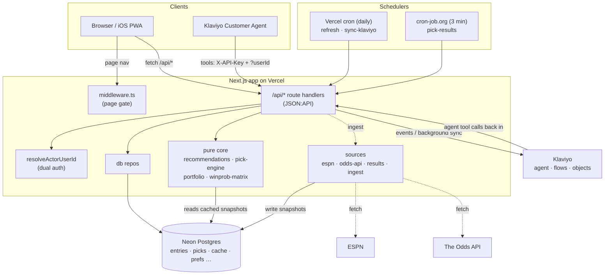
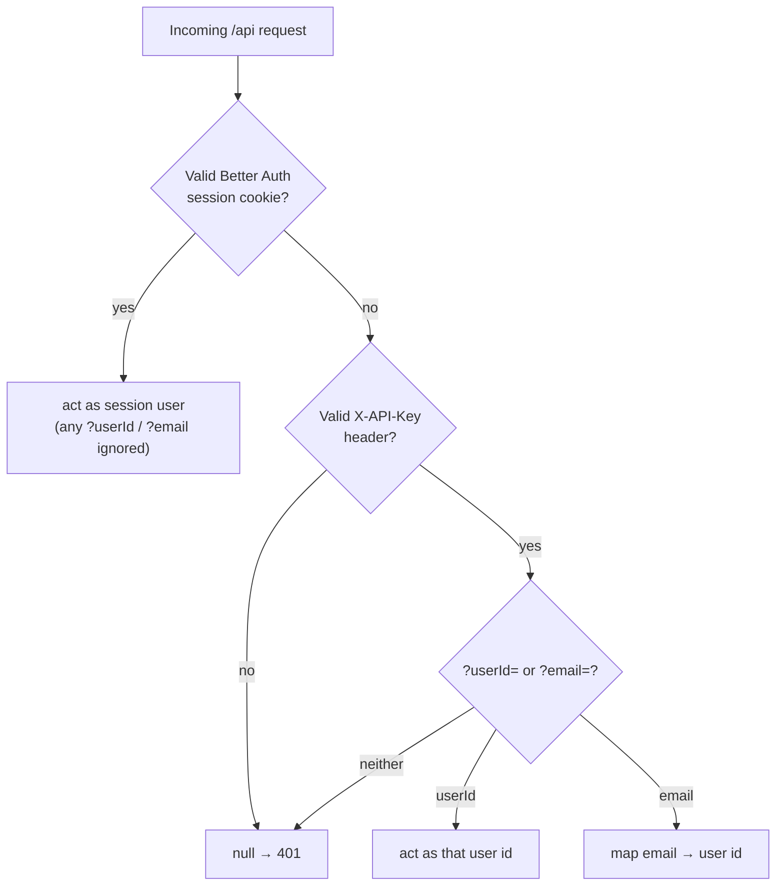
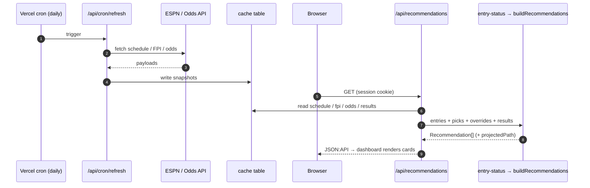

# Architecture

Four layers: a **pure core** (no I/O), the **data sources** that feed it, a **data model** in
Postgres, and the **app** (pages and JSON:API routes) that ties them to users.
[`klaviyo.md`](klaviyo.md) covers the Klaviyo layer.

## System overview

No request calls ESPN or The Odds API. The schedulers write each source into the `cache` table,
and requests read those snapshots. There are two schedulers because Vercel's Hobby plan allows only
daily crons (see [ADR 0004](adr/0004-external-scheduler-pick-results.md)).

### Who a request acts as

One function decides, `resolveActorUserId` ([ADR 0001](adr/0001-jsonapi-everywhere-dual-auth.md)):

A session always wins, so a signed-in user can never act as someone else. The API-key path works
only with a valid key, so no one can spoof it.

## Pure core (`src/lib`)

No I/O. Deterministic. Unit-tested against fixtures. Given the schedule, team strengths, and odds,
it returns win probabilities and pick recommendations.

| Module | What it does |
| --- | --- |
| `odds.ts` | Turn American moneylines into a win probability and **de-vig** it (remove the bookmaker margin). |
| `projection.ts` | Turn ESPN FPI ratings into a matchup win probability. Used for future weeks with no odds yet. |
| `win-prob.ts` / `winprob-matrix.ts` | Per-matchup win prob, then the week × team matrix for an entry, minus teams it has used. |
| `matching.ts` | `maxWeightAssignment` — a Hungarian-style max-weight assignment over a (weeks × teams) matrix. |
| `pick-engine.ts` | `optimalPath` assigns one team per remaining week to maximize the **product** of win probs (summed logs). `recommendFromPath` picks this week's team, applies the safety floor, and writes the reason. |
| `portfolio.ts` | Plans a whole **pool** together so two of your entries don't use the same team in the same week. |
| `recommendations.ts` | Orchestrator. Builds each entry's matrix, plans each pool over its live entries, resolves this-week clashes. Returns the `Recommendation[]` the dashboard, projection, sync, and assistant all use. |
| `elimination.ts` | Decides whether and when an entry is out, honoring manual `pick_overrides`. |
| `game-views.ts` | Shapes schedule + odds + results into the per-game view the UI and sync render. |
| `week.ts` | `currentWeek` (schedule + clock) and `resolveSeason` (`NFL_SEASON`). |
| `entry-status.ts` | Joins an owner's entries, picks, overrides, and results into the status object every surface builds on. |

Why the product of probabilities, not the greedy weekly best:
[ADR 0002](adr/0002-season-optimal-pick-engine.md).

## Data sources (`src/lib/sources`)

Fetch → normalize → cache. Each parser is tested against captured fixtures in `tests/fixtures/`, so
a unit test catches an upstream shape change before production.

- `espn-schedule.ts` — the season schedule (weeks, matchups, kickoff times).
- `espn-fpi.ts` — FPI team ratings (drive future-week projections).
- `odds-api.ts` — this week's moneylines from The Odds API.
- `results.ts` — live and final scores; `getResultsFresh`, `resultForGame`.
- `injuries.ts` — notable injuries per team from Sleeper (free, no key): starters or QBs who are
  Out/Doubtful/Questionable this week (IR/PUP are dropped as long-term, not game-day).
  `getInjuriesFresh` refetches on a schedule-aware TTL — short near a kickoff (inactives land then),
  long otherwise.
- `ingest.ts` — the refresh pipeline: fetch each source, normalize, write to `cache`. Called by
  `POST /api/refresh` and the `refresh` cron.

Everything reads the `cache` table, so the core and each request use snapshots instead of calling
ESPN or The Odds API.

## Data model (`src/lib/db`)

Neon serverless Postgres. The client (`client.ts`) is lazy and sends plain reads over HTTP fetch
(WebSockets only for transactions). `schema.sql` is idempotent (`CREATE TABLE IF NOT EXISTS` plus
additive `ALTER`s) and runs on `npm run migrate`.

- **Better Auth tables** — `user`, `session`, `account`, `verification` (from the Better Auth CLI).
  `entries.owner_id` FKs to `user(id)`.
- **`entries`** — `id`, `name`, `owner_id` (NOT NULL; one owner per entry), and a `settings` JSONB
  (`pool`, `min_win_chance`, `ties_survive`, `pick_due`).
- **`picks`** — one row per entry-week. `UNIQUE(entry_id, team)` and `UNIQUE(entry_id, week)`
  enforce the rules. Stores `win_prob_at_pick` and `win_prob_pregame` (refreshed until kickoff,
  then frozen).
- **`pick_overrides`** — manual `survived` / `out` / `revived` per entry-week.
- **`push_subscriptions`** — one row per browser/device with push on.
- **`pick_result_notifications`** — dedup: one row per notification sent.
- **`chat_conversations`** — maps a Klaviyo `conversation_id` to its owner, so the transcript read
  is authorized. Klaviyo holds the messages.
- **`cache`** — key → JSONB snapshot of each source.

The repos (`entries-repo`, `picks-repo`, `users-repo`, `push-repo`, `cache-repo`,
`pick-overrides-repo`, `result-notifications-repo`) are the only code that runs SQL.

## The app (`src/app`)

**Pages** (`/`, `/grid`, `/matchups`, `/plan`, `/calendar`, `/settings`, `/assistant`, `/signin`)
sit behind `src/middleware.ts`, an edge check that sends visitors without a session cookie to
`/signin`. It only checks for a cookie. The API routes do the real authorization on each request.

**API routes** are JSON:API and the only way to read or write state. The UI and the agent use the
same endpoints; only the authentication differs. Every route calls `resolveActorUserId(req)`
(`lib/agent-auth.ts`), which returns:

1. the **session** user id if a valid Better Auth cookie is present (a signed-in user always wins
   and can never act as someone else), or
2. the user named by `?userId=` / `?email=`, but **only** with the valid shared `X-API-Key` (the
   agent path, which has no browser session).

[ADR 0001](adr/0001-jsonapi-everywhere-dual-auth.md) says why the UI has no path of its own.

Main routes:

| Route | Purpose |
| --- | --- |
| `GET /api/recommendations` | This week's pick **and** the full projected path per entry (feeds the dashboard and the `/plan` page). |
| `GET /api/grid?filter[entry]=&filter[week]=` | Win-prob grid; the week filter lets the assistant ask about any week. |
| `GET /api/matchups?filter[week]=` | A week's games with odds and win %. |
| `POST /api/simulate-plan` | What-if: rebuild an entry's path for a hypothetical pick without locking it. |
| `POST /api/picks` | Record a pick (the DB enforces the rules). |
| `POST /api/pick-overrides` | Manual survived/out/revived. |
| `POST\|PATCH\|DELETE /api/entries[/id]` | Entry CRUD, per owner. |
| `POST /api/refresh` | Run the ingest pipeline now. |
| `/api/auth/[...all]` | Better Auth (Google, magic link, session). |
| `/api/chat` | Proxies the in-app assistant to the Klaviyo agent. |
| `/api/push/{subscribe,send}` | Web-push subscribe and deliver. |
| `/api/cron/{refresh,sync-klaviyo}` | Daily Vercel cron jobs. |
| `/api/cron/pick-results` | Pick/live notifications; polled every ~3 min by an outside scheduler ([ADR 0004](adr/0004-external-scheduler-pick-results.md)). |

A write that changes entries or picks starts a **background Klaviyo sync**, so the Custom Objects
copy stays current without blocking the response — see [`klaviyo.md`](klaviyo.md).

## How a dashboard load flows

`buildRecommendations` also feeds the projection page, the Klaviyo sync, and the assistant's tools.
One engine serves every surface.
