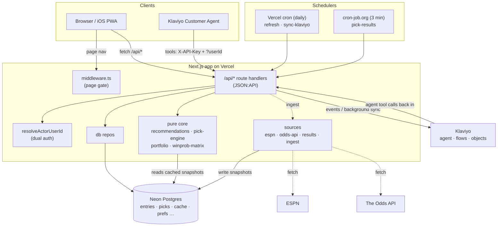
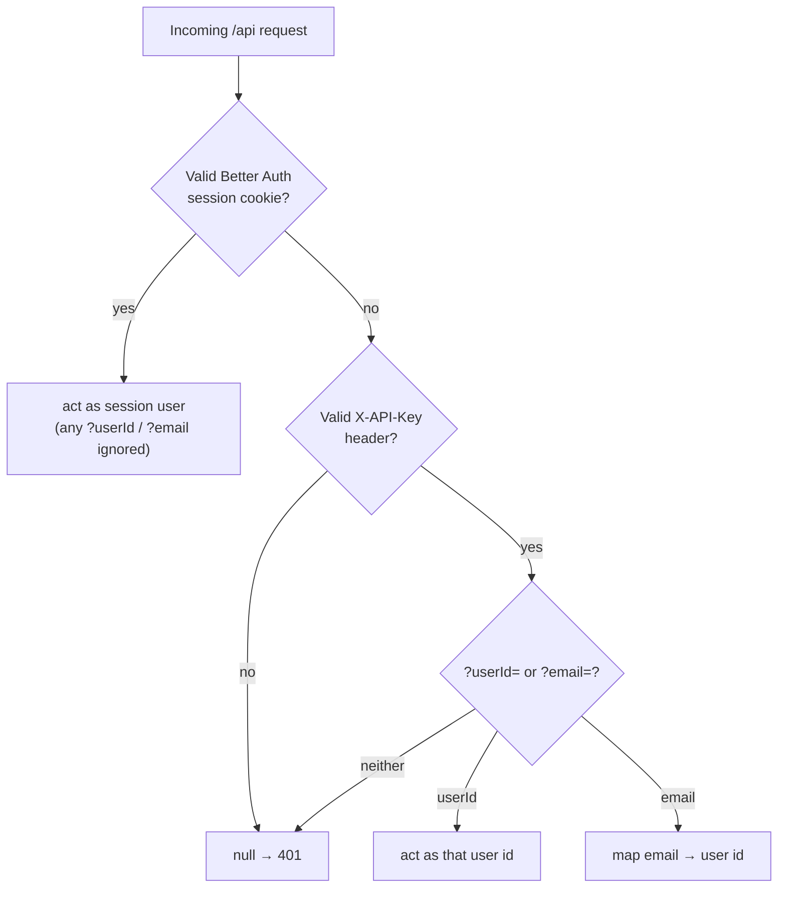
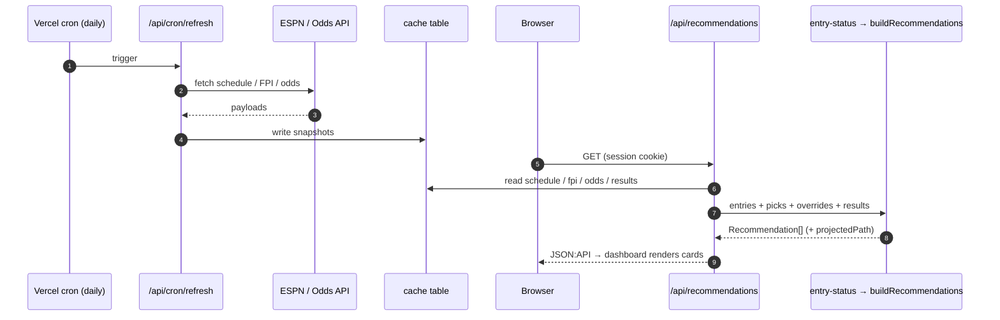

# Architecture

How the pieces fit together. The system has four layers: a **pure domain core** (no I/O), the
**data sources** that feed it, a **data model** in Postgres, and the **app** (pages + JSON:API
routes) that ties them to users. [`klaviyo.md`](klaviyo.md) documents the Klaviyo messaging layer
separately.

## System overview

Reads never call ESPN or The Odds API directly. The schedulers write each source into the
`cache` table, and every request reads those snapshots. There are two schedulers because Vercel's
Hobby plan allows only daily crons (see [ADR 0004](adr/0004-external-scheduler-pick-results.md)).

### Access pattern (who a request acts as)

Every `/api` request resolves an acting user through one function, `resolveActorUserId`
([ADR 0001](adr/0001-jsonapi-everywhere-dual-auth.md)):

A signed-in session always wins and can never act as someone else. The API-key path (the agent
or automation) works only when the key is valid, so no one can spoof it.

## The pure domain core (`src/lib`)

Everything here is deterministic, I/O-free, and unit-tested against fixtures. Given schedule,
team strengths, and odds, it produces win probabilities and pick recommendations.

| Module | Responsibility |
| --- | --- |
| `odds.ts` | Convert American moneylines to implied probability and **de-vig** (remove the bookmaker margin) to a fair win probability. |
| `projection.ts` | Convert ESPN FPI team ratings into a logistic win probability for a matchup (used for future weeks with no live odds yet). |
| `win-prob.ts` / `winprob-matrix.ts` | Per-matchup win prob, then the week × team matrix of win probs for an entry, excluding the teams it has already used. |
| `matching.ts` | `maxWeightAssignment` — a Hungarian-style max-weight bipartite assignment over a (weeks × teams) matrix. |
| `pick-engine.ts` | `optimalPath` assigns one team per remaining week to maximize the **product** of win probs (summed logs). `recommendFromPath` derives the current-week pick, applies the safety-floor override, and writes human-readable reasoning. |
| `portfolio.ts` | Plans a whole **pool** of entries together so they diversify — two of your entries don't use the same team in the same week. |
| `recommendations.ts` | Orchestrator: builds per-entry win-prob matrices, plans each pool over its alive entries, and resolves current-week collisions. Produces the `Recommendation[]` the dashboard, projection, sync, and assistant all consume. |
| `elimination.ts` | Determines whether/when an entry is eliminated, honoring manual `pick_overrides`. |
| `game-views.ts` | Shapes schedule + odds + results into the per-game view the UI and sync render. |
| `week.ts` | `currentWeek` (from the schedule + clock) and `resolveSeason` (from `NFL_SEASON`). |
| `entry-status.ts` | Joins an owner's entries, picks, overrides, and results into the status object every surface builds on. |

**Why product-of-probabilities, not greedy highest-win-prob:** see
[ADR 0002](adr/0002-season-optimal-pick-engine.md).

## Data sources (`src/lib/sources`)

Fetch → normalize → cache. Each parser is tested against captured fixtures in `tests/fixtures/`,
so a unit test catches a change in an upstream payload shape before it reaches production.

- `espn-schedule.ts` — the season schedule (weeks, matchups, kickoff times).
- `espn-fpi.ts` — FPI team strength ratings (drives future-week projections).
- `odds-api.ts` — current-week moneylines from The Odds API.
- `results.ts` — live/final scores; `getResultsFresh` and `resultForGame`.
- `ingest.ts` — the refresh pipeline: fetch each source, normalize, and write to the `cache`
  table. Invoked by `POST /api/refresh` and the `refresh` cron.

Reads go through the `cache` table, so the domain core and every request use cached snapshots
instead of calling ESPN or The Odds API on each request.

## Data model (`src/lib/db`)

Neon serverless Postgres. The client (`client.ts`) is lazy and routes plain reads over HTTP
fetch (WebSockets only for transactions). `schema.sql` is idempotent (`CREATE TABLE IF NOT
EXISTS` + additive `ALTER`s) and applied by `npm run migrate`.

- **Better Auth tables** — `user`, `session`, `account`, `verification` (generated by the
  Better Auth CLI, made idempotent). `entries.owner_id` FKs to `user(id)`.
- **`entries`** — `id`, `name`, `owner_id` (NOT NULL — every entry belongs to one user), and a
  `settings` JSONB (`pool`, `min_win_chance`, `ties_survive`, `pick_due`).
- **`picks`** — one row per entry-week. `UNIQUE(entry_id, team)` and `UNIQUE(entry_id, week)`
  enforce the survivor rules in the database. Captures `win_prob_at_pick` and a
  `win_prob_pregame` that is refreshed until kickoff then frozen.
- **`pick_overrides`** — manual `survived` / `out` / `revived` outcomes per entry-week.
- **`push_subscriptions`** — one row per browser/device that enabled web push.
- **`pick_result_notifications`** — dedup ledger so each entry-week result notification sends once.
- **`chat_conversations`** — maps a Klaviyo Customer Agent `conversation_id` to its owning user, so the assistant transcript read can be authorized (Klaviyo holds the messages themselves).
- **`cache`** — key → JSONB snapshot of each ingested source.

The repos (`entries-repo`, `picks-repo`, `users-repo`, `push-repo`, `cache-repo`,
`pick-overrides-repo`, `result-notifications-repo`) are the only things that touch SQL.

## The app (`src/app`)

**Pages** (`/`, `/grid`, `/matchups`, `/plan`, `/calendar`, `/settings`, `/assistant`,
`/signin`) are gated by `src/middleware.ts`, a coarse edge check that redirects visitors without
a session cookie to `/signin`. It only checks for a cookie; the API routes do the real
authorization on each request.

**API routes** are JSON:API and are the only way to read or write state. The UI and the Klaviyo
agent use the same endpoints; only their authentication differs. Every route calls
`resolveActorUserId(req)` (`lib/agent-auth.ts`), which returns:

1. the **session** user id if a valid Better Auth cookie is present (a signed-in user always
   wins and can never act as someone else), else
2. the user named by `?userId=` / `?email=` **only if** the request carries the valid shared
   `X-API-Key` (the automation/agent path, which has no browser session).

See [ADR 0001](adr/0001-jsonapi-everywhere-dual-auth.md) for why the UI has no private path of
its own and everything is an API.

Representative routes:

| Route | Purpose |
| --- | --- |
| `GET /api/recommendations` | Current-week recommendation **and** full projected path per entry (feeds both the dashboard and the `/plan` projection page). |
| `GET /api/grid?filter[entry]=&filter[week]=` | Win-prob grid; the week filter lets the assistant ask about any week's available teams. |
| `GET /api/matchups?filter[week]=` | A week's games with odds/win %. |
| `POST /api/simulate-plan` | What-if: rebuild an entry's projected path for a hypothetical pick without locking it. |
| `POST /api/picks` | Record a pick (DB enforces the survivor rules). |
| `POST /api/pick-overrides` | Manual survived/out/revived override. |
| `POST\|PATCH\|DELETE /api/entries[/id]` | Entry CRUD (per owner). |
| `POST /api/refresh` | Run the ingest pipeline on demand. |
| `/api/auth/[...all]` | Better Auth (Google, magic link, session). |
| `/api/chat` | Proxies the in-app assistant to the Klaviyo Customer Agent. |
| `/api/push/{subscribe,send}` | Web-push subscription + delivery. |
| `/api/cron/{refresh,sync-klaviyo}` | Scheduled jobs (Vercel cron, daily). |
| `/api/cron/pick-results` | Pick/live notifications; polled every ~3 min by an external scheduler (see [ADR 0004](adr/0004-external-scheduler-pick-results.md)). |

Writes that change entries or picks start a **background Klaviyo sync**, so the Custom Objects
mirror stays current without blocking the response — see [`klaviyo.md`](klaviyo.md).

## Request/data flow (example: loading the dashboard)

The same `buildRecommendations` output feeds the projection page, the Klaviyo sync, and the
assistant's tools. One engine serves every surface.
