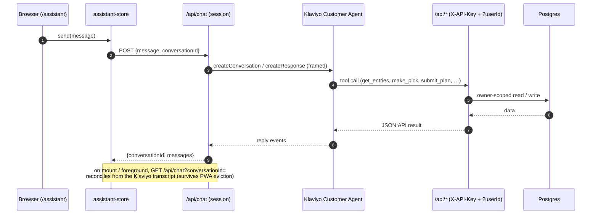
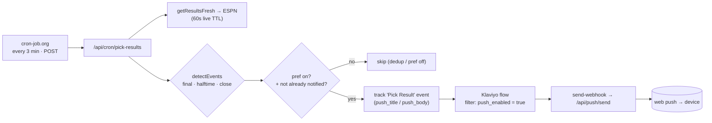

# Klaviyo integration

Klaviyo carries everything the app sends. Four parts:

1. **Strategy assistant** — the in-app chat, backed by the Klaviyo Customer Agent.
2. **Custom Objects sync** — every entry and pick, copied into Klaviyo.
3. **Notification flows** — sign-in links, push toggles, and pick alerts.
4. **Web push** — browser notifications, sent by a flow webhook.

Why the app uses Klaviyo instead of a separate notification service:
[ADR 0003](adr/0003-klaviyo-as-integration-spine.md).

## Code

| File | What it does |
| --- | --- |
| `src/lib/klaviyo-http.ts` | Base URL, API revisions (`2026-07-15` stable, `2026-07-15.pre` beta), and `klaviyoHeaders(revision)`. |
| `src/lib/klaviyo.ts` | Events and profiles (`trackEvent`, `upsertProfile`, `linkProfileExternalId`), magic-link email, the Customer Agent calls, and `frameForRouting`. |
| `src/lib/klaviyo-objects.ts` | Custom Objects sync: map entries/picks to records, push via bulk jobs, delete records. |
| `scripts/provision-agent.ts` | One-shot provisioner. The source of truth for the agent (secret, tools, knowledge, skill), the magic-link email template, and the three flows. |

## Identity

One app user maps to one Klaviyo profile by **`external_id` = our `user.id`**. On account
creation, a Better Auth `databaseHooks.user.create.after` hook calls `linkProfileExternalId`, which
creates and links the profile right away (best-effort; it never blocks sign-up). Events then find
the profile by `external_id` or `email`.

Agent tool calls pass the user's id in the message framing (below). We don't rely on
`{{ person.external_id }}`, which comes out empty in some webhook contexts.

## 1. Strategy assistant (Customer Agent)

The chat (`/assistant`, `src/components/AssistantChat.tsx`) posts to `/api/chat`. That route starts
or continues a **Customer Agent conversation** tied to the signed-in user's profile and returns the
agent's replies.

**Surviving a lost reply.** The conversation lives in a module-level store (`assistant-store.ts`),
so an in-flight request survives in-app navigation. The hard case is when the page dies
mid-request — for example, when iOS evicts a backgrounded PWA. The reply arrives only as the POST
response, so it would be lost. Klaviyo keeps the record. `getConversationMessages` reads the
transcript from `GET /customer-agent-conversations/{id}/customer-agent-messages` (the messages are
a *relationship* on the conversation, not an attribute). `GET /api/chat?conversationId=` returns
that transcript to the owner — authorized by the `chat_conversations` id→user map written on
create — and strips the routing framing off stored user messages. The client calls it on mount and
when the app returns to the foreground, so it recovers a reply that landed while the page was gone.
If iOS kills the page before the POST leaves the device, Klaviyo never got it: nothing to recover,
and no duplicate.

**Routing and framing.** `frameForRouting(message, userId)` prefixes each message with
`(NFL survivor pool · user=<id>)`. This does two jobs: it steers Klaviyo's router to our
*survivor-strategy* skill, not the stock General Q&A, and it carries the server-verified user id
for the agent to pass to its tools. The server adds the id, so the client can't fake it. We pass
the id, not the email, to keep PII out of the transcript.

**Tools.** The agent calls the same JSON:API routes the UI uses. It authenticates with the shared
`X-API-Key` and names the user via `?userId=`. `scripts/provision-agent.ts` provisions them:

| Tool | Endpoint | Use |
| --- | --- | --- |
| `get_entries` | `GET /api/recommendations`-style status | Each entry's status, current pick, used teams, projected path. |
| `get_matchups` | `GET /api/matchups` | A week's games with odds and win %. |
| `get_week_options` | `GET /api/grid?filter[entry]=&filter[week]=` | Best **available** teams and win % for an entry, **any** week. |
| `plan_whatif` | `POST /api/simulate-plan` | Rebuild the path for a hypothetical pick without locking it. |
| `make_pick` | `POST /api/picks` | Record one week's pick (any week, after the user confirms in chat). |
| `submit_plan` | `POST /api/picks/bulk` | Lock an entry's whole remaining path in one call, from a single computation so the weeks stay consistent. |
| `create_entry` / `update_entry` / `delete_entry` | `/api/entries[/id]` | Manage entries. |

The skill instructions say plainly that the agent **can** submit picks and must never claim
otherwise. An earlier version kept telling users "I can't submit picks from here" and submitted
only when pushed. The instructions also tell it to treat the user as signed in, pass the `userId`
on every call, and **confirm a tool succeeded before claiming the action is done**. Re-run
`provision-agent.ts` to reset them; live edits run against the beta revision.

**One message, end to end** — note that the agent's tools loop back into our own JSON:API, and the
reconcile path that recovers a lost reply:

## 2. Custom Objects sync (`klaviyo-objects.ts`)

Two shared object types, **Entry** and **Pick**, copy the app's state into Klaviyo so flows and
messages can read it. `syncOwner(ownerId)` reuses the same status, recommendation, and game-view
computation the dashboard uses, so the records match the app. The Entry record holds alive/out
state, the current and suggested pick, used teams, and the projected path. Each Pick record holds
the matchup, win prob, and result.

- Records go up in **bulk create jobs** (batches of 500) to a shared data source.
- Record ids are stable (`<entryId>` for entries, `<entryId>:<week>` for picks), so a re-sync
  updates instead of duplicating.
- A write that changes entries or picks calls `syncOwnerInBackground` /
  `deleteEntryRecordsInBackground` — fire-and-forget, so a slow or failing Klaviyo call never
  blocks or breaks the request.
- The nightly `sync-klaviyo` cron calls `syncAllOwners` to catch any drift.

## 3. Notification flows

Every notification has the same shape: the app tracks a Klaviyo **event**, a **flow** reacts, and a
**webhook** delivers a push (or the flow sends an email). The pick pipeline, the most involved one,
end to end:

`src/lib/game-events.ts` does the detection and writes the copy. The backend gates each event on
the `notification_prefs` table and dedups on `(entry, week, event_type)`. The magic-link and
pick-reminder flows use the same event → flow → (email | webhook) shape with different triggers
(table below).

`scripts/provision-agent.ts` defines the three flows and the magic-link email template, so they're
reproducible and in version control, not clicked together in the UI. The script resolves the
template, metrics, and flows by name and skips any that exist. (Klaviyo can't PATCH a flow
*definition*; to change one, rename or delete it and re-run.) The email sender comes from
`FLOW_FROM_EMAIL` / `FLOW_FROM_LABEL`, and the webhook `X-API-Key` comes from the app's `API_KEY`.

| Flow | Trigger | Profile filter | Action |
| --- | --- | --- | --- |
| **Magic Link Sign-In** | metric `Magic Link Requested` | none | `send-email` with the *Survivor — Magic Link* template; renders `{{ event.magic_link_url }}` (valid 15 min). |
| **Pick Result** | metric `Pick Result` | `push_enabled = true` | `send-webhook` → `/api/push/send` with `{{ event.user_id }}` + title/body/url. |
| **Pick Reminder** | date-based off the Entry's `pick_due` | `push_enabled = true` | `target-date` → `send-webhook` → `/api/push/send` (by `{{ person.email }}`), for owners who haven't picked. |

The **Pick Result** flow carries *all* pick notifications, not just win/loss. The event carries an
`event_type` (`final` / `halftime` / `close`) and a ready-made `push_title` / `push_body`, so the
flow just forwards what the backend decided. The backend gates each type on the owner's
**notify_final / notify_live** preference (the `notification_prefs` table, set on Settings) and
dedups on `(entry, week, event_type)`, so each alert sends once.

`pick_due` is a weekly deadline. `weeklyDeadlineISO` turns it into a concrete UTC timestamp and
syncs it onto the Entry object (see §2). A date-triggered flow must start with a `target-date`
action, so Pick Reminder has two steps.

Two events are tracked but have no flow yet, ready to build on: `Signed Up` (account created, with
a `method` of `google`/`magic_link`), and `Push Enabled` / `Push Disabled`.

## 4. Web push

Browser push uses VAPID (`web-push`) with a service worker (`public/sw.js`). `/api/push/subscribe`
stores one subscription per device. A flow webhook posts to `/api/push/send`, which looks up the
user's subscriptions (by `userId` or `email`, trimmed) and sends the notification. The flow filters
on the `push_enabled` profile property.

## Scheduling

| Job | Scheduler | Cadence | Does |
| --- | --- | --- | --- |
| `refresh` | Vercel cron | daily 16:00 UTC | Load schedule / FPI / odds into the cache. |
| `sync-klaviyo` | Vercel cron | daily 16:30 UTC | Re-sync every owner's Custom Object records. |
| `pick-results` | **outside** (cron-job.org) | every ~3 min | Detect and send pick notifications (final + live). |

`pick-results` must run every few minutes on game day to make close-game alerts timely. Vercel's
**Hobby** plan runs crons only once a day, so an outside scheduler drives it: a
[cron-job.org](https://cron-job.org) job calls `POST /api/cron/pick-results` every 3 minutes with
`Authorization: Bearer <CRON_SECRET>`. It's a `POST` because the route changes state — it sends
pushes and writes the dedup ledger. The route is idempotent and self-gating: it **returns early**
when no game has kicked off, and dedups on `(entry, week, event_type)`, so running every 3 minutes
all year is cheap and safe. `?seed=1` marks current events as notified without sending (run once on
setup, so it doesn't send a backlog). `?debug=1` (or a plain `GET`) returns a read-only report —
each current-week picked game's live state and what it *would* send — without sending or writing,
so you can check live halftime/close detection during a real game. The results cache refetches live
games on a 60-second TTL, so 3-minute polling sees fresh scores. `refresh` and `sync-klaviyo` stay
on Vercel, since once a day is fine.
