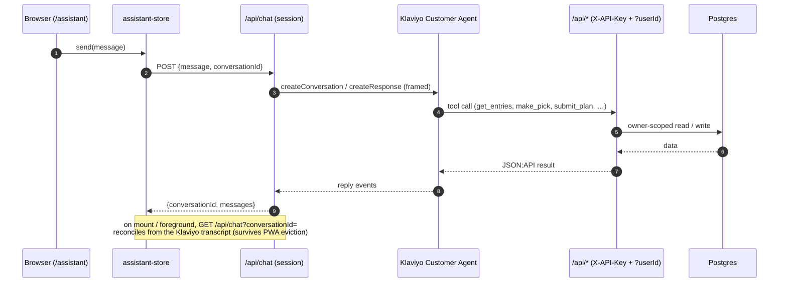
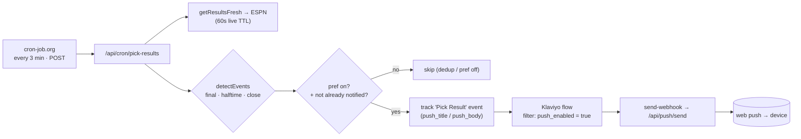

# Klaviyo integration

Klaviyo is the app's messaging and conversational layer. Four things run through it:

1. **The strategy assistant** — an in-app chat backed by the Klaviyo Customer Agent.
2. **Custom Objects sync** — every entry and pick mirrored into Klaviyo as shared objects.
3. **Notification flows** — sign-in links, push enable/disable, and pick-result alerts.
4. **Web push** — browser notifications delivered via a Klaviyo flow webhook.

For *why* the app uses Klaviyo instead of a separate notification service, see
[ADR 0003](adr/0003-klaviyo-as-integration-spine.md).

## Code layout

| File | Responsibility |
| --- | --- |
| `src/lib/klaviyo-http.ts` | Base URL, API revisions (`2026-07-15` stable, `2026-07-15.pre` beta), and `klaviyoHeaders(revision)`. |
| `src/lib/klaviyo.ts` | Events/profiles (`trackEvent`, `upsertProfile`, `linkProfileExternalId`), magic-link email, the Customer Agent conversation/response calls, and `frameForRouting`. |
| `src/lib/klaviyo-objects.ts` | Custom Objects sync: map entries/picks to records, push via bulk jobs, and delete records. |
| `scripts/provision-agent.ts` | One-shot provisioner — the source of truth for the agent (secret, tools, knowledge, skill), the magic-link email template, and the three notification flows. |

## Identity model

The link between an app user and a Klaviyo profile is **`external_id` = our `user.id`**. On
account creation, a Better Auth `databaseHooks.user.create.after` hook calls
`linkProfileExternalId` so the profile exists and is linked immediately (best-effort; never
blocks sign-up). Events then target the profile by `external_id` or `email`.

Agent tool calls pass the acting user's id explicitly (via the message framing, below) rather
than relying on `{{ person.external_id }}`, which renders empty in some webhook contexts.

## 1. The strategy assistant (Customer Agent)

The in-app chat (`/assistant`, `src/components/AssistantChat.tsx`) posts to `/api/chat`, which
creates/continues a **Customer Agent conversation** tied to the signed-in user's profile and
returns the agent's replies.

**Durability / reconcile.** The conversation lives in a module-level store
(`assistant-store.ts`), so an in-flight request survives in-app navigation. A harder case is when
the page is destroyed mid-request — for example, when iOS evicts a backgrounded home-screen PWA.
The agent reply arrives only as the POST response, so it would otherwise be lost. Klaviyo keeps
the record: `getConversationMessages` reads the transcript from
`GET /customer-agent-conversations/{id}/customer-agent-messages` (the messages are a *relationship*
on the conversation, not in its attributes). `GET /api/chat?conversationId=` returns that
transcript to the owner — authorized by the `chat_conversations` id→user mapping written on
create — and strips the routing framing off stored user messages. The client calls it on mount
and on return to the foreground, so it recovers a reply that landed while the page was gone. (If
iOS destroys the page before the POST leaves the device, Klaviyo never received it: nothing to
recover, and no duplicate.)

**Routing + auth framing.** `frameForRouting(message, userId)` prefixes every outgoing message
with `(NFL survivor pool · user=<id>)`. This does two jobs: it steers Klaviyo's skill router to
our *survivor-strategy* skill (not the prebuilt General Q&A), and it carries the server-verified
user id for the agent to pass to its tools. The id is injected server-side, so the client can't
spoof it, and we pass the id, not the email (no PII in the transcript).

**Tools.** The agent calls the same JSON:API routes the UI uses. It authenticates with the shared
`X-API-Key` and names the user via `?userId=`. `scripts/provision-agent.ts` provisions them:

| Tool | Endpoint | Use |
| --- | --- | --- |
| `get_entries` | `GET /api/recommendations`-style status | Each entry's status, current pick, used teams, projected path. |
| `get_matchups` | `GET /api/matchups` | A week's games with odds/win %. |
| `get_week_options` | `GET /api/grid?filter[entry]=&filter[week]=` | Best **available** teams + win % for an entry in **any** week. |
| `plan_whatif` | `POST /api/simulate-plan` | Rebuild the projected path for a hypothetical pick without locking it. |
| `make_pick` | `POST /api/picks` | Record one week's pick (any week, after explicit user confirmation in chat). |
| `submit_plan` | `POST /api/picks/bulk` | Lock in an entry's entire remaining projected path in one call (all not-yet-picked future weeks, from a single computation so they stay consistent). |
| `create_entry` / `update_entry` / `delete_entry` | `/api/entries[/id]` | Entry management. |

The skill instructions state plainly that the agent **can** submit picks and must never claim
otherwise. An earlier version kept telling the user "I can't submit picks from here" and
submitted only when pushed.

The skill instructions tell the agent to treat the user as already authenticated, to extract and
pass the `userId` on every call, and to **verify a tool succeeded before claiming an action is
done**. Re-running `provision-agent.ts` is the source of truth; live edits (new tools, skill
instruction changes) are applied against the beta revision.

**Flow of one message** (note the agent's tools loop back into our own JSON:API, and the
reconcile path that recovers a reply if the page died mid-request):

## 2. Custom Objects sync (`klaviyo-objects.ts`)

Two shared object types — **Entry** and **Pick** — mirror the app's state into Klaviyo so flows
and messages can reference it. `syncOwner(ownerId)` reuses the same status, recommendation, and
game-view computation the dashboard uses, so the records match what the app shows. The Entry
record carries alive/eliminated state, the current and suggested pick, used teams, and the
projected path. Each Pick record carries the matchup, win prob, and result.

- Records push through **bulk create jobs** (batches of 500) against a shared data source.
- Record ids are stable (`<entryId>` for entries, `<entryId>:<week>` for picks) so re-syncing
  upserts rather than duplicating.
- Writes that mutate entries/picks call `syncOwnerInBackground` / `deleteEntryRecordsInBackground`
  — fire-and-forget, so a slow or failing Klaviyo call never blocks or breaks the user's request.
- The nightly `sync-klaviyo` cron calls `syncAllOwners` to reconcile any drift.

## 3. Notification flows

Every notification has the same shape: the app tracks a Klaviyo **event**, a **flow** reacts, and
a **webhook** calls back to deliver a push (or the flow sends an email). The pick-notification
pipeline, the most complex one, end to end:

Detection and copy live in `src/lib/game-events.ts`; gating uses the `notification_prefs` table
and the `(entry, week, event_type)` dedup ledger. The magic-link and pick-reminder flows follow
the same event→flow→(email | webhook) shape with different triggers (see the table below).

The app tracks Klaviyo **events** (metric names in `klaviyo.ts`); flows react to them. The three
live flows and the magic-link email **template** are defined in `scripts/provision-agent.ts`, so
they're reproducible and version-controlled rather than click-configured. The script is
idempotent — it resolves the template/metrics/flows by name and skips anything that already
exists. (Klaviyo flow *definitions* can't be PATCHed; to change one, rename/delete it in Klaviyo
and re-run.) Sender identity for the email is parameterized via `FLOW_FROM_EMAIL` /
`FLOW_FROM_LABEL`, and the webhook `X-API-Key` comes from the app's `API_KEY`.

| Flow | Trigger | Profile filter | Action |
| --- | --- | --- | --- |
| **Magic Link Sign-In** | metric `Magic Link Requested` | none | `send-email` using the *Survivor — Magic Link* template; renders `{{ event.magic_link_url }}` (valid 15 min). |
| **Pick Result** | metric `Pick Result` | `push_enabled = true` | `send-webhook` → `/api/push/send` with `{{ event.user_id }}` + title/body/url, delivering a web-push notification. |
| **Pick Reminder** | date-based off the Entry object's `pick_due` property | `push_enabled = true` | `target-date` → `send-webhook` → `/api/push/send` (by `{{ person.email }}`), nudging owners who haven't locked in. |

The **Pick Result** flow handles *all* pick notifications, not just win/loss — the `Pick Result`
event carries an `event_type` (`final` / `halftime` / `close`) plus a precomputed `push_title` /
`push_body`, so the flow just forwards whatever the backend decided. Detection and message copy
live in `src/lib/game-events.ts`; the backend also gates each type on the owner's **notify_final /
notify_live** preference (`notification_prefs` table, edited on the Settings page) and dedups per
`(entry, week, event_type)`, so a given alert sends at most once.

`pick_due` is a recurring weekly deadline resolved to a concrete UTC timestamp by
`weeklyDeadlineISO` and synced onto the Entry object (see §2). A date-triggered flow must begin
with a `target-date` action, which is why Pick Reminder has two steps.

Other events are tracked today but **don't have flows yet** — they're available to build on:
`Signed Up` (account created, with a `method` of `google`/`magic_link`), and
`Push Enabled` / `Push Disabled` (web-push toggles).

## 4. Web push

Browser push uses VAPID (`web-push`) with a service worker (`public/sw.js`). `/api/push/subscribe`
stores a subscription per device; a Klaviyo flow webhook posts to `/api/push/send`, which looks up
the user's subscriptions (by `userId`/`email`, trimmed) and delivers the notification. Push-enabled
profiles are filtered in-flow on a `push_enabled` profile property.

## Scheduling

| Job | Scheduler | Cadence | Does |
| --- | --- | --- | --- |
| `refresh` | Vercel cron | daily 16:00 UTC | Ingest schedule / FPI / odds into the cache. |
| `sync-klaviyo` | Vercel cron | daily 16:30 UTC | Reconcile all owners' Custom Object records. |
| `pick-results` | **external** (cron-job.org) | every ~3 min | Detect & fire pick notifications (final + live). |

`pick-results` needs to run every few minutes on game day (for timely close-game alerts), but this
project is on Vercel's **Hobby** plan, where crons can only run **once per day**. So it's driven by
an external scheduler instead — a [cron-job.org](https://cron-job.org) job hitting
`POST /api/cron/pick-results` every 3 minutes with `Authorization: Bearer <CRON_SECRET>` (POST
because the route mutates state — sends pushes, writes the dedup ledger). The route
is idempotent and self-gating: it **early-exits** when no game has kicked off, and dedups per
`(entry, week, event_type)`, so running every 3 minutes year-round is cheap and safe. `?seed=1`
marks all currently-true events as notified without sending (run once on setup, so it doesn't send
a backlog of old results). `?debug=1` (or a plain `GET`) returns a read-only dry report — each current-week picked
game's live state plus what it *would* send and whether each event is suppressed by prefs/dedup —
without firing or writing anything, so you can validate live halftime/close detection during a
real game. The results cache refetches live games on a 60-second TTL, so 3-minute polling sees
fresh scores. `refresh` / `sync-klaviyo` stay on Vercel since once-a-day is fine for them.
